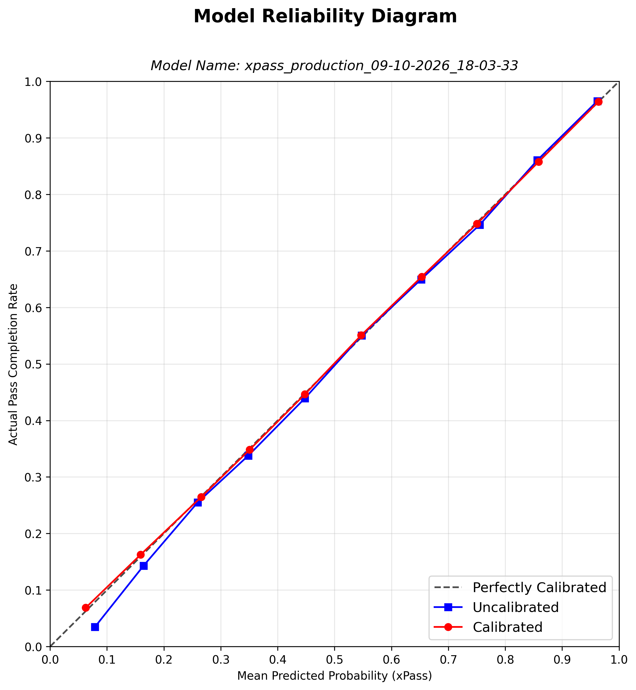
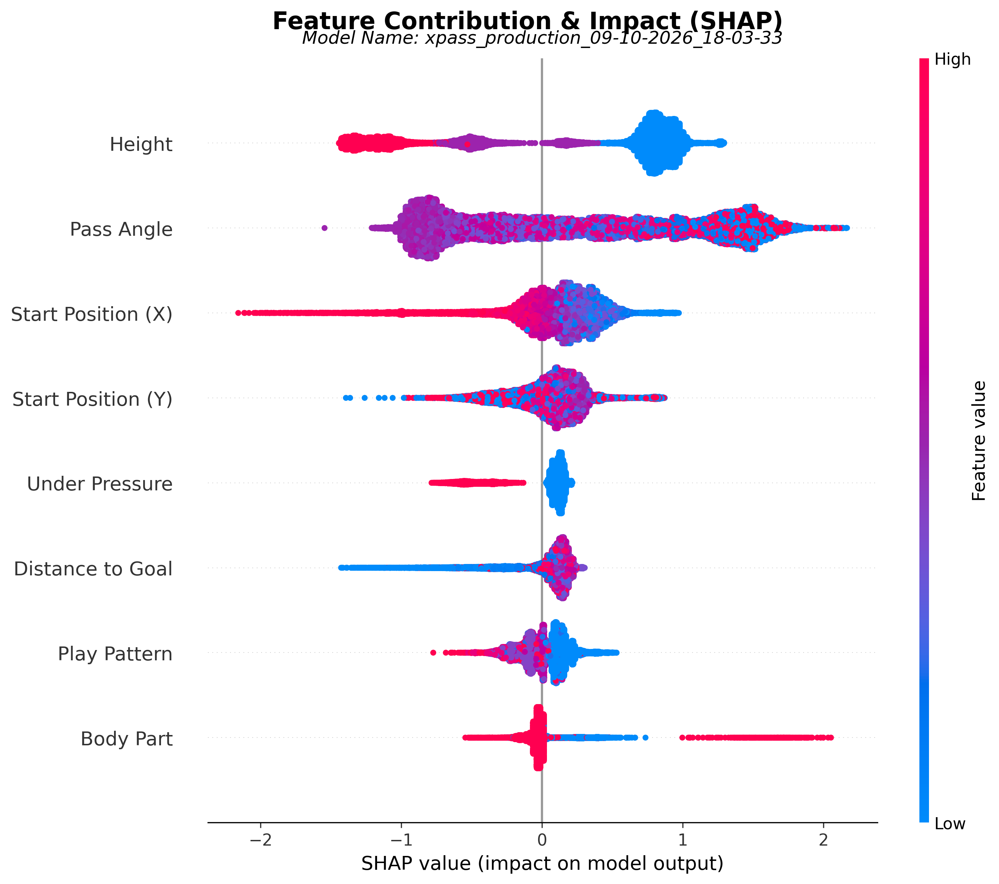
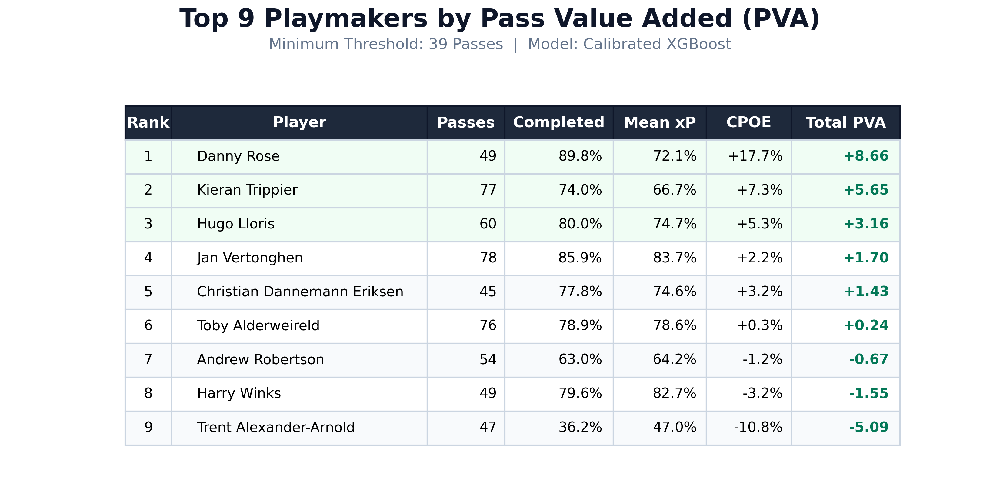
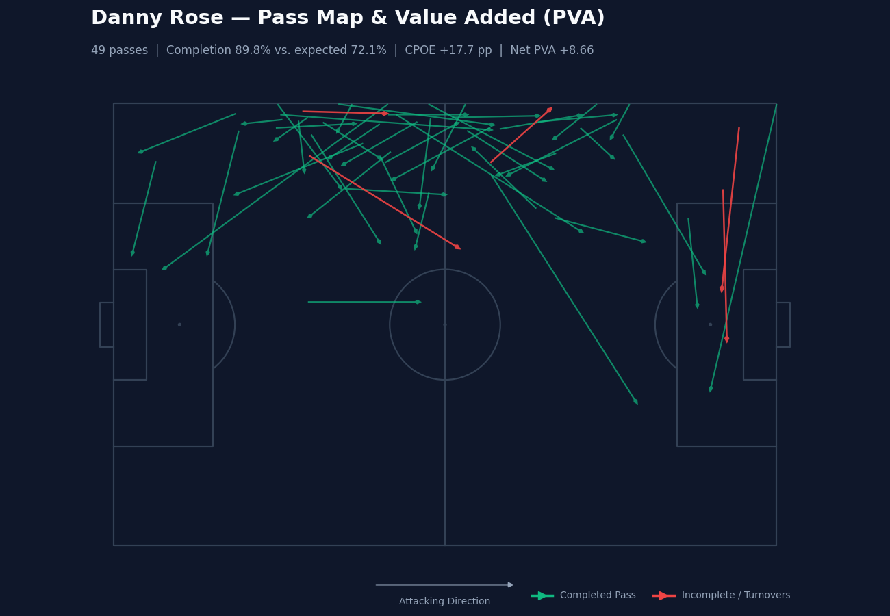

# xPass: Expected Pass Completion

xPass is an expected pass-completion model. It gives every pass a probability of being completed (xP), based on where the pass starts, its angle, its distance to goal, its height, the body part used, the play pattern and whether the passer is under pressure. Those per-pass scores are then added up for each player and each team as **Pass Value Added (PVA)**, which is the actual outcome (1 = completed, 0 = failed) minus xP, and **Completion Percentage Over Expected (CPOE)**, which is the actual completion rate minus the expected completion rate. A player who completes difficult passes builds up positive PVA and CPOE. A player who misses easy ones builds up negative values.

## Results

The model is an XGBoost classifier with isotonic calibration. It was trained on **3,836,550 passes** from **3,961 StatsBomb match files** and scored on a held-out test set.

| Metric   | Hold-out score (random 85/15 split by pass) |
|----------|---------------------------------------------|
| ROC AUC  | 0.8748                                      |
| Log-loss | 0.3543                                      |
| Brier    | 0.1118                                      |

Read these numbers together with the [Limitations](#limitations) below.

**Calibration.** The reliability diagram compares predicted xP with the share of passes that were actually completed:



**Feature importance.** SHAP values for a sample of test passes:



**Example output.** A player leaderboard ranked by total PVA, and a pass map for the top player:





## Limitations

- **The test split is by pass, not by match.** The 85/15 hold-out is a random, stratified split of individual passes. Passes from the same match, and the same team and players, therefore appear in both the training set and the test set. A split by match (or by season) would give a stricter estimate of performance on unseen games.
- **`pass_angle` partly encodes the outcome for out-of-play passes.** The angle is taken from StatsBomb's pass data, which is derived from `end_location`. For a pass that goes out of play, `end_location` records where the ball went, not where the intended receiver was. For those passes the feature carries some information about the result.
- **`is_progressive` is an approximation.** It is computed only from the pass length and whether the pass starts and ends in the own half or the opponent's half, and not from distance gained towards goal. It is part of the processed dataset but is not one of the model's features.
- **Player and team PVA/CPOE are mostly in-sample.** The pipeline scores the same dataset the model was trained on, so about 85% of the passes behind PVA, CPOE, the leaderboard and the pass map were seen during training. This pulls completions and misses slightly towards what the model expected, so PVA and CPOE sit a little closer to zero than truly out-of-sample values would. The effect is larger on small, single-season runs. To score unseen passes, point step 4 at a different dataset with `--dataset`.

## Features

The model uses the following 17 features, defined in [`src/features.py`](src/features.py). The categorical groups are one-hot encoded, and each group leaves one category out as the baseline: ground passes for height, and any body part or play pattern without its own column (for example "From Counter").

| # | Feature | Group |
|---|---------|-------|
| 1 | `start_x` | Location |
| 2 | `start_y` | Location |
| 3 | `pass_angle` | Geometry |
| 4 | `dist_to_goal` | Geometry |
| 5 | `height_Low Pass` | Pass height |
| 6 | `height_High Pass` | Pass height |
| 7 | `body_part_Foot` | Body part |
| 8 | `body_part_Head` | Body part |
| 9 | `body_part_Keeper Arm` | Body part |
| 10 | `play_pattern_Regular Play` | Play pattern |
| 11 | `play_pattern_Kick Off` | Play pattern |
| 12 | `play_pattern_Throw In` | Play pattern |
| 13 | `play_pattern_Free Kick` | Play pattern |
| 14 | `play_pattern_Goal Kick` | Play pattern |
| 15 | `play_pattern_Keeper` | Play pattern |
| 16 | `play_pattern_Corner` | Play pattern |
| 17 | `under_pressure` | Context |

## Quick start

### 1. Install

Use Python 3.13. The versions in `requirements.txt` were tested with Python 3.13.14.

```bash
git clone <this-repo-url>
cd xPass-Project
python -m venv .venv
# Windows:      .venv\Scripts\activate
# macOS/Linux:  source .venv/bin/activate
pip install -r requirements.txt
```

### 2. Run the pipeline on one season

Run this from the repository root:

```bash
python run_all.py --league "La Liga" --season "2015/2016"
```

This command downloads that season's match files from StatsBomb's open-data repository, then builds the dataset, trains a model, scores every pass and draws the charts. The repository doesn't include any data or trained models, so the first run needs an internet connection.

### 3. Run the pipeline on everything

```bash
python run_all.py
```

With no arguments, the pipeline downloads every competition and season in StatsBomb's open data. The full download plus the processed datasets comes to around 9 GB on disk. Comparing players only makes sense within one league and season, so the visualization step will ask which one to chart. In an unattended run it skips the charts instead of waiting for an answer.

### The six steps

`run_all.py` runs each step as a separate Python process. The pipeline stops at the first step that fails and prints the command to re-run just that step. You can also run any step on its own from `run_files/`.

| # | Step | Script | What it does | Output |
|---|------|--------|--------------|--------|
| 1 | Data Ingestion | `run_files/run_data_ingestion.py` | Downloads StatsBomb open event data, one JSON file per match. Matches already on disk are skipped, so re-runs only fetch new data. | `data/raw/statsbomb_free/<League>/<Season>/<match_id>.json` |
| 2 | Data Analysis | `run_files/run_data_analysis.py` | Turns raw match events into one row per pass: pitch coordinates, angle, distance to goal, game state, height, body part, play pattern, pressure and outcome. Matches are processed in parallel. | `data/processed/processed_passes_*.csv` |
| 3 | Model Training | `run_files/run_model.py` | Trains a plain XGBoost model and an isotonic-calibrated one (5-fold CV) on the newest processed dataset. Both are compared on the 15% hold-out, and the one with the lower log-loss is kept. Writes a metrics report, a reliability diagram and a SHAP diagram. | `models/final/model_<timestamp>/` |
| 4 | Predictions | `run_files/run_predictions.py` | Adds `xP` and `PVA` columns to every pass, using the newest model. | `models/final/model_<timestamp>/datasets/pre analysis/xp_added_passes_*.csv` |
| 5 | Post-Analysis | `run_files/run_post_analysis.py` | Aggregates passes, completions, total xP, total PVA, actual and expected completion rate, and CPOE per player and per team. | `models/final/model_<timestamp>/datasets/post analysis/{player,team}_analysis_*.csv` |
| 6 | Visualizations | `run_files/run_visualizations.py` | Draws the PVA leaderboard, a risk vs. execution scatter plot, a team quadrant chart (mean xP against CPOE) and a pass map for the top player. | `models/final/model_<timestamp>/visuals/*.png` |

Steps 1, 2 and 6 accept `--league` and `--season`. Steps 3 to 5 always use the newest outputs of the earlier steps. Step 4 can also be pointed at specific files:

```bash
python run_files/run_predictions.py --model path/to/model.joblib --dataset path/to/passes.csv
```

## Repository layout

```
xPass-Project/
├── run_all.py                     # runs all six steps end to end
├── run_files/                     # one entry-point script per step
│   ├── run_data_ingestion.py
│   ├── run_data_analysis.py
│   ├── run_model.py
│   ├── run_predictions.py
│   ├── run_post_analysis.py
│   └── run_visualizations.py
├── src/                           # pipeline logic used by the scripts
│   ├── data_ingestion_pipeline.py
│   ├── data_analysis_pipeline.py
│   ├── features.py                # the 17 model features (shared by training and prediction)
│   ├── model_training_pipeline.py
│   ├── predictions_pipeline.py
│   ├── post_analysis_pipeline.py
│   ├── visualizations_pipeline.py
│   ├── naming.py
│   └── console.py
├── docs/                          # figures used in this README
├── requirements.txt
├── LICENSE
└── README.md

# Created locally when you run the pipeline (not tracked by git):
├── data/raw/statsbomb_free/       # downloaded match files
├── data/processed/                # per-pass datasets
└── models/final/model_<timestamp>/  # model, reports, scored passes, summaries, figures
```

## Data and attribution


**Data source: StatsBomb.** This project uses real StatsBomb open data from [github.com/hudl/open-data](https://github.com/hudl/open-data), and uses it for training and testing only. The data is not included in this repository. The ingestion step downloads it directly from StatsBomb's repository.

The open-data README sets this condition:

> "If you publish, share or distribute any research, analysis or insights based on this data, please state the data source as StatsBomb and use our logo, available in our [Media Pack](https://statsbomb.com/media-pack/)."

The StatsBomb Public Data User Agreement ([LICENSE.pdf](https://github.com/hudl/open-data/blob/master/LICENSE.pdf)) states:

> "1.4. The User is required to accredit any publication of analysis formed from StatsBomb Data with the StatsBomb brand logo."

Anyone who runs this pipeline is bound by the same agreement. Read it before you use or publish anything built on the data.

The MIT license in [`LICENSE`](LICENSE) covers the code in this repository only, not StatsBomb's data.

